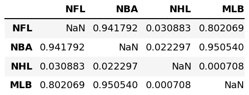

# BIG4

Here we are relating a metropolitan regions with associated sports teams from assets/wikipedia_data.html and answer some questions about each metropolitan region with 2018 data: 

## 

1. **What is the win/loss ratio's correlation with the population of the city it is in? Win/Loss ratio refers to the number of wins over the number of wins plus the number of losses.**

Win/loss ratio's correlation with city population for  **NHL**: 0.012486162921209909

Win/loss ratio's correlation with city population for **NBA**: -0.17657160252844614

Win/loss ratio's correlation with city population for **MLB**: 0.15027698302669307

Win/loss ratio's correlation with city population for **NFL**: 0.004922112149349409

As you can see for the differents sports the population of the city is very low correlate with the win/loss ratio

##

2. **Explore the hypothesis tha given that an area has two sports teams in different sports, those teams will perform the same within their respective sports. Are there any sports where we can reject the null hypothesis?**

As you can see from the image the NFL-NBA, NFL-MLB and NBA-MLB groups reject the null hypothosis.